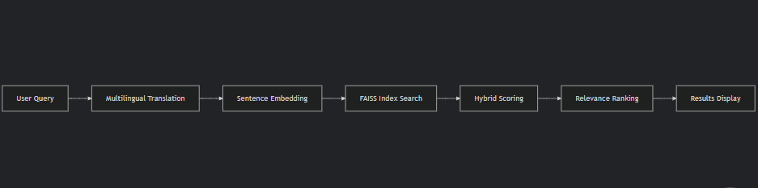

# Movie Recommendation Telegram Bot


This professional Telegram bot helps users discover movies through various search methods using semantic AI and TMDB integration. Supporting 3 languages (English, Russian, Kazakh), it provides personalized recommendations through natural language understanding.

## Key Features
### Multilingual Interface
Fully localized for English, Russian, and Kazakh speakers

### Smart Search Capabilities
1. Genre-based filtering
2. Actor/actress lookup
3. Year-based recommendations
4. Top-rated movies discovery
5. Semantic search ("find movies like...")
6. Hybrid scoring (popularity + relevance)

###  AI-Powered Features
1. Sentence embeddings for semantic similarity
2. Neural machine translation
3. Text completion hints
4. Review/content matching

### User Experience
1. Interactive menus with pagination
2. Movie details with ratings/runtime
3. Feedback collection system
4. Conversation history ("repeat last")

##  Technology Stack

| Category          | Technologies                                                                 |
|-------------------|------------------------------------------------------------------------------|
| **Core**          | Python 3.10+, python-telegram-bot 20.x                                       |
| **NLP**           | SentenceTransformers, HuggingFace Transformers, FAISS                       |
| **Translation**   | GoogleTranslator, MarianMT                                                  |
| **APIs**          | TMDB API (movie database)                                                   |
| **Storage**       | SQLite (user feedback), Pickle (movie embeddings)                           |
| **Infrastructure**| Asyncio, ThreadPoolExecutor                                                 |

## Installation

1. Clone repository:
```bash
git clone https://github.com/HieLyan/tg-bot.git
cd movie-recommendation-bot
```
2. Install dependencies:
```bash
pip install -r requirements.txt
```
3. Set up environment variables:
```bash
echo "TELEGRAM_TOKEN=your_bot_token" > .env
echo "TMDB_API_KEY=your_tmdb_key" >> .env
```
4. Download pre-trained models:
```bash
python -c "from sentence_transformers import SentenceTransformer; SentenceTransformer('sentence-transformers/paraphrase-multilingual-MiniLM-L12-v2')"
python -c "from transformers import MarianMTModel, MarianTokenizer; MarianMTModel.from_pretrained('Helsinki-NLP/opus-mt-mul-en')"
```
5. Launching the Bot
```bash
python bot.py
```

## Project Structure
```bash
├── bot.py                 - Main application entry point
├── config.py              - Configuration module (API keys)
├── messages.json          - Localization strings
├── movies.index           - FAISS vector index (precomputed)
├── movies_meta.pkl        - Movie metadata (precomputed)
├── users.db               - SQLite database (user feedback)
├── requirements.txt       - Python dependencies
└── README.md              - This documentation
```
## Supported Commands
<details>
<summary> Click to expand full command list</summary>

| Command Type       | Parameters               | Example Usage          | Description                                  |
|--------------------|--------------------------|------------------------|----------------------------------------------|
| `/start`           | None                     | `/start`               | Initialize bot and select language           |
| **Genre Search**   | Genre name               | `Action`               | Browse movies by category                    |
| **Actor Search**   | Actor name               | `Tom Hanks`            | Find movies featuring specific actors        |
| **Year Filter**    | Release year             | `2005`                 | Discover films from particular years         |
| **Top 10**         | None                     | `Top 10`               | View highest-rated movies                    |
| **Custom Search**  | Mixed parameters         | `Comedy 2010 Jim Carrey`| Hybrid search with multiple filters         |
| **Feedback**       | Rating + optional comment| `Like - great bot!`    | Rate recommendations and provide comments    |

</details>
## AI Implementation Details

### Semantic Search Pipeline


##  Key Algorithms
### Hybrid Scoring
```python
final_score = 0.7 * semantic_similarity + 0.3 * (normalized_rating / 10)
```
## Feedback System

### Database Schema
```sql
CREATE TABLE feedback (
    id INTEGER PRIMARY KEY AUTOINCREMENT,
    user_id INTEGER NOT NULL,
    lang TEXT NOT NULL,          -- Language preference (en/ru/kk)
    rating TEXT CHECK(rating IN ('like', 'dislike', 'comment')),
    comment TEXT,                -- Optional user comments
    age INTEGER CHECK(age BETWEEN 1 AND 120),  -- Optional age range
    ts DATETIME DEFAULT CURRENT_TIMESTAMP
);
```
